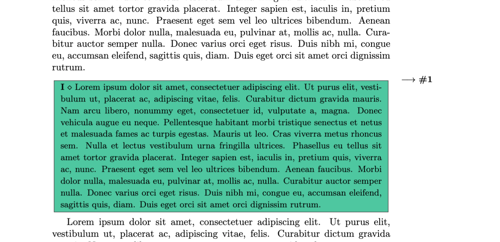
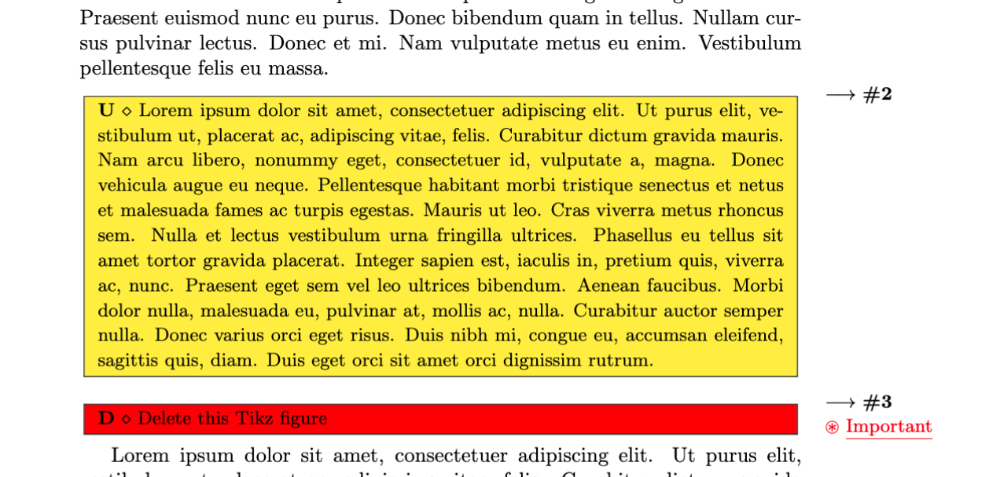
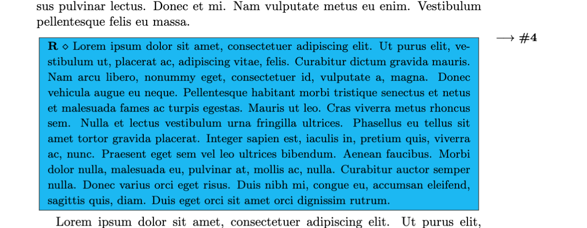

# SuperTODO - TODO $\TeX$ extension

 &nbsp; 

## Introduction

**`SuperTODO`** is a LaTeX package handling the creation and manipulation of TODO frames, frequently used for long-report writing.

With a large variety of commands (insert, update, delete, ...)[^1], you can easily plan and highligh further tasks to do within your $\TeX$ document and focus yourself on the main writing. 

This package is written using the $\LaTeX 2_\varepsilon$ environment which provides us high-level commands for structuring new packages.


**Open to contributions**: Feel free to submit a PR in order to extend the available features for a better LaTeX writing experience.

## Features

**Upload to CTAN**[^2]: The upload on CTAN is planned and will be performed in the coming days.

Tested and fully operationnal on the following document classes:
- `article`
- `report`
- `book`

### Getting started

1. Import the package. It can be either:
    - imported from CTAN
    - downloaded from the current release and put in the same-level directory as the main file from your project

In both cases, you can finally use the package with the following *at the top of the compiled document*:
```latex
\usepackage{supertodo}
```

2. After the `\begin{document}` tag, add the specified **`SuperTODO`** tag:

```latex
\begin{document}
...

\insertTD{Add the image}
\updateTD{Change the font size here}
\deleteTD{Remove the last item}
\reviewTD{Review the fifth item above}

... 
\end{document}
```

**Remarks**:
- By default, the frames are printed as **blocks** environment. You can force the frame to be embedded within the current text with the optional parameter: `inline`
```latex
\insertTD[inline]{Add the image}
```
- You can also raise a flag regarding the importance level of the task to be completed
```latex
\deleteTD*{Delete this Tikz figure}
```

### Available environments

| Level  | Background color  | Inline | Block |
|:------:|------------------|--------|-------|
|  INSERT      |  GREEN       |  ✅      |  ✅     |
|  UPDATE      |    YELLOW         |  ✅      |  ✅     |
|  DELETE      |       RED           | ✅       |  ✅     |
|  REVIEW      |       BLUE               |  ✅      |  ✅     |

TODO: Some examples with inline/block, important/normal, ...


The **`SuperTODO`** allows a wide flexibility on implementation by making easy to the end-user the declaration and use of new commands.

### Add a new command

If you want to implement a new command, denoted below as `abcde`, please procede as follows:

```latex
\usepackage{supertodo}

% To be specified AFTER the supertodo package import, NEVER BEFORE !!
\NewDocumentCommand\abcdeTD{O{block} s m}{
    \block[#1][<capital>][<bgcolor>][<fgcolor>][#2]{#3}
}
```
where you can specify:
- **`abcde`**: the name of the new command
- `<capital>`: the letter(s) or text character(s) to be specified before the payload text
- `<bgcolor>`: background color of the frame
- `<fgcolor>`: foreground color of the frame (text + border color)

You can then use the command as follows:

```latex
\abcdeTD{Insert the fifth image here}
```

**Don't forget the `TD`** suffix for every command from this package.

### Screenshots

<p align="center">
  
  
  
</p>

### Sample document

You can easily test the module with this [sandbox document](#).

## References

The development phases required the study and reading of the following online references:

- https://www.overleaf.com/learn/latex/Understanding_packages_and_class_files
- https://www.overleaf.com/learn/latex/Writing_your_own_package
- https://www.overleaf.com/learn/latex/Margin_notes
- https://www.ctan.org/help/upload-pkg
- https://mirror.ibcp.fr/pub/CTAN/macros/latex/base/clsguide.pdf

## License

Development: **Lucas RODRIGUEZ** (August 2022 - ...)

Please check the [LICENSE](LICENSE) file for the complete license information.

[^1]: The default commands follow the CRUD (CREATE, READ, UPDATE, DELETE) terminology.

[^2]: **CTAN**: Comprehensive $\TeX$ Archive Network [official website](https://www.ctan.org/)